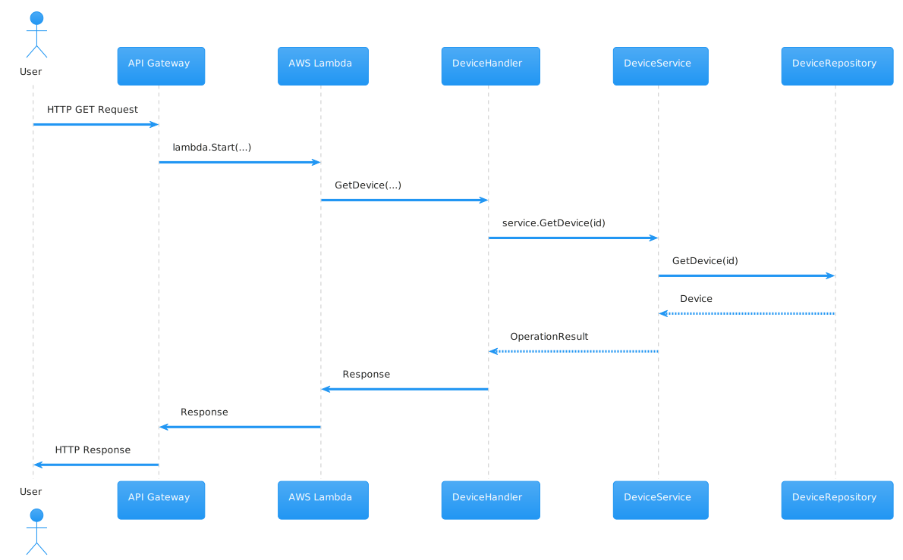

# IoTWatcher


**IoTWatcher** simplifies the process of tracking device health and identifying potential issues. 
Operators can quickly retrieve logs for specific device states, enabling proactive maintenance and minimizing downtime. 
Supervisors can easily monitor escalated logs, facilitating efficient resource allocation and timely issue resolution.

IoTWatcher is a powerful and scalable application built using Go, Serverless, AWS API Gateway, Lambda, and DynamoDB. 
It is designed to streamline the monitoring and management of IoT devices in smart factory environments.

Note: This app is actively still in development mode.

## Highlights features
- Follow Clean Architecture discipline for code structure and naming.
-  Running with multiple configurations:
    - Database : Memory or DynamoDb.
    - API gateway : Local, or Amazon API gateway+ Lambda.
- More than 70% test code coverage at high priority files.
- Easy start with GNU Make.
- Automated deployment via Serverless framework.
- Every important topics is well documented.

## Requirements
- [Go 1.20+](https://go.dev/doc/install) 
- [GNU Make 4+](https://www.gnu.org/software/make/) (optional for automatically commands)
- [Serverless 3+](https://www.serverless.com/framework/docs-getting-started) (optional for automatic deploy on aws)

## Quick start 
### Easy start
First copy `.env.example` as `.env`(for local) or `.en.prod`(for production and AWS) and change proper configuration.

You can start project **locally** with this command:
```
make run-local
```

Or deploy on **AWS** with:
``` 
make deply
```
Note: For serverless configuration, this document is good resources: [Serverless aws-golang-rest-api-with-dynamodb](https://github.com/serverless/examples/blob/v3/aws-golang-rest-api-with-dynamodb/serverless.yml)

### Manually
To set up project follow these steps:

- First install all module dependencies
```bash 
go mod tidy
```

- Up and run Database. If you execute project locally, setup DynamoDB via docker. Otherwise, on AWS you need to define Instance.
```
docker compose up -d
```

- Execute bash script to define DynamoDB table and seed data at local.
```
./schema/schema-seed-data.sh
```

- To start the server use the following command:
```
go run main.go
```
Finally,  send request locally to  `http://localhost:8080/api/devices/` and get response. for AWS use `https://<api-gateway-url>/api/devices/`

## CRUD Operations : Testing endpoint API
After running application you can access to CRUD urls:

```bash
# Create new devices
curl --header "Content-Type: application/json" \
 --request POST \
 --data '{"id":"/devices/id4","deviceModel":"/devicemodels/id1","name":"Camera","note":"Testing a camera","serial":"A020000103"}' \
 --url https://<api-url>/api/devices

# HTTP 400 Bad Request, id invalid format, and name is empty.
curl --header "Content-Type: application/json" \
 --request POST \
 --data '{"id":"id r4","deviceModel":"id1","note":"Testing a camera","serial":"A020000103"}' \
 --url https://<api-url>/api/devices/
  
# Read a device info
curl --header "Content-Type: application/json" \
 --request GET \
 --url https://<api-url>/api/devices/id4

# Update a device info
curl --header "Content-Type: application/json" \
 --request PUT \
 --data '{"deviceModel":"/devicemodels/id1","name":"Camera","note":"NEW Testing a camera","serial":"A020000103"}' \
 --url https://<api-url>/api/devices/id4

# Check changed info 
curl --header "Content-Type: application/json" \
 --request GET \
 --url https://<api-url>/api/devices/id4

# Delete a device
curl --header "Content-Type: application/json" \
 --request DELETE  \
 --url https://<api-url>/api/devices/id4

 # Get 404 Not found 
curl --header "Content-Type: application/json" \
 --request GET \
 --url https://<api-url>/api/devices/id4

```


## Folder structure
This project use common folder structure for a Go REST API:

```bash

simple-api/
├── main.go
├── handlers/
│   └── device_handler.go
├── routes/
│   └── routes.go
├── models/
│   └── device.go
├── repositories/
│   ├── device_repository.go
│   └── device_memory_repository.go
│   └── device_dynamodb_repository.go
├── services/
│   └── device_service.go
├── db/
│   └── db.go
└── utils/
    └── utils.go
```
Here's a breakdown of the folders and files:

- `main.go`: This is the entry point of application, where is initialized and run server, as well as set up dependencies and configurations.
- `handlers/device_handler.go`: This file contains the HTTP handler functions for the Device resource, handling the CRUD operations.
- `routes/routes.go`: This file defines the routes for API, including the Device resource routes.
- `models/device.go`: This file defines the `Device` struct and any related types or methods.
- `repositories/device_repository.go`: This is an interface that defines the methods for interacting with the Device data store.
- `repositories/device_memory_repository.go`: This is an in-memory implementation of the `DeviceRepository` interface.
- `repositories/device_dynamodb_repository.go`: This is an DynamoDB implementation of the `DeviceRepository` interface.
- `services/device_service.go`: This file contains the business logic for the Device resource, orchestrating the interactions between the repository and the handlers.
- `db/db.go`: This file sets up the database connection and provides a way to access the database object throughout the application.
- `utils/utils.go`: This folder can hold any reusable utility functions or packages used across the application.

This structure is flat and straightforward, with fewer nested folders. It's a common and widely accepted structure for smaller to medium-sized projects.
Here is the



## Testing
From the project’s root directory, run test:
```bash
go test -v ./...

```

To view the test coverage you can run:
```bash
go test -coverprofile=coverage.out ./...
go tool cover -html=coverage.out 
```

## TODO
- [x] Writing project specifications documentation.
- [x] Writing configuration document. 
- [x] How to Deploy on AWS.
- [x] Validating and sanitize user's input.
- [x] Add DynamoDbTable via Serverless, [details](https://github.com/serverless/examples/blob/22865199326008b9f863cb1ad28bfdddae9a7473/aws-node-http-api-typescript-dynamodb/serverless.yml).
- [x] Improve the `TestDeviceMemory` unit tests by adding more cases.

### Medium priority 
- [ ] Add `handler.ListDevice` method to service and repository.
- [ ] Add AWS::IAM::Role via Serverless, [details](https://github.com/serverless/examples/blob/22865199326008b9f863cb1ad28bfdddae9a7473/aws-node-graphql-and-rds/resource/LambdaRole.yml).
- [ ] Improve local development with configure `serverless deploy --stage local`. Read more at: 
  - [Use the Serverless Framework with LocalStack](https://docs.localstack.cloud/user-guide/integrations/serverless-framework/)
  - [localstack serverless rest-api with dynamodb](https://github.com/localstack/serverless-python-rest-api-with-dynamodb)
  - [Using Serverless Framework & Localstack to test your AWS applications locally](https://medium.com/manomano-tech/using-serverless-framework-localstack-to-test-your-aws-applications-locally-17748ffe6755)
  - Another different way which above ways not worked, using AWS Lambda Runtime Interface Emulator (RIE).

 
